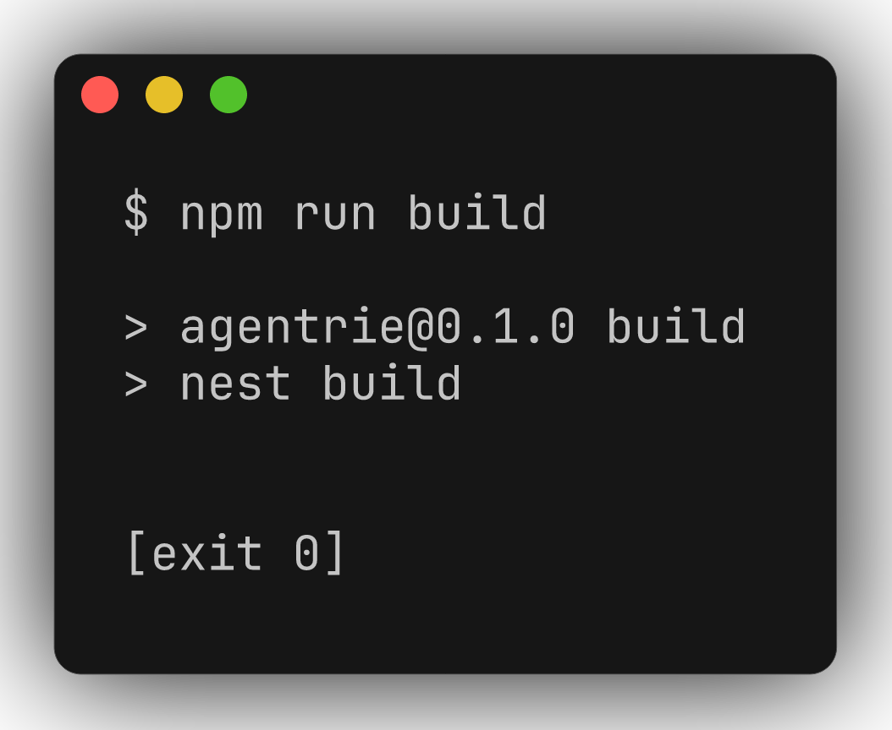
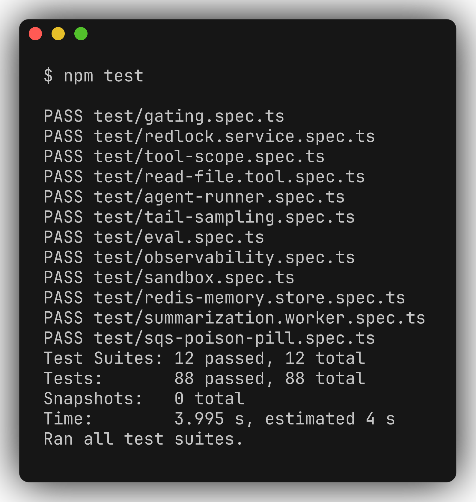
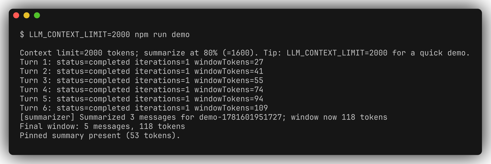
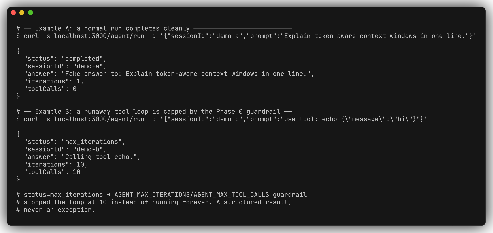
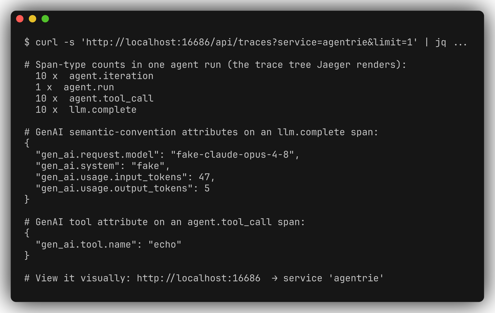
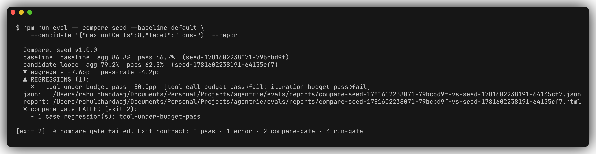

# agentrie — terminal demo

Real, captured terminal output proving the platform runs end-to-end with **no AWS
account and no API key** (the deterministic `FakeLlmProvider` runs everything
offline). Every screenshot below was generated from an actual run against the local
Docker stack (Redis, Mongo, LocalStack, Jaeger); the raw text is in
[`demo/captures/`](./demo/captures) and the images in
[`demo/screenshots/`](./demo/screenshots).

The story in one line: **see what the agent did, and prove whether it's good.**

---

## 0. Prerequisites (one-time, off camera)

```bash
npm install
docker compose up -d              # redis, mongo, localstack, jaeger
bash scripts/localstack-init.sh   # provision SQS/SNS + DLQ
cp .env.example .env              # defaults target the docker stack
docker compose ps                 # confirm all 4 healthy
```

---

## 1. It's real: strict build + full test suite

`npm run build` compiles every phase under strict TS; `npm test` runs 88 tests
across 12 suites (idempotency, poison-pill→DLQ, summarization trigger + eviction,
the agent loop, eval determinism, regression detection) — **no Docker required for
the tests**.





---

## 2. Agent loop + state management (Phase 0 + 1)

Six agent turns against a session. The token-aware Redis window grows each turn;
summarization compresses the oldest evictable half into a single **pinned summary**
(guarded by a Redis lock). Mongo holds every message as the source of truth.

```bash
LLM_CONTEXT_LIMIT=2000 npm run demo
```



> The 80%-of-context-limit **auto-trigger** is covered deterministically by the unit
> tests (`test/redis-memory.store.spec.ts`, `test/summarization.worker.spec.ts`);
> the demo forces one summarization at the end so the on-screen output is stable.

---

## 3. Live HTTP run + structured guardrails

```bash
npm run start:dev        # or: node dist/main.js
```

Example A is a normal completion. Example B fires a tool directive that the fake
provider re-emits every turn — so it demonstrates the **Phase 0 guardrail**
(`AGENT_MAX_ITERATIONS` / `AGENT_MAX_TOOL_CALLS`) capping a runaway loop at 10 and
returning a *structured* result instead of throwing.



---

## 4. Observability: the trace the agent emitted

Same run, read straight back out of Jaeger's API: one `agent.run` root, a span per
iteration, and child `llm.complete` / `agent.tool_call` spans carrying GenAI
semantic-convention attributes (`gen_ai.system`, `gen_ai.request.model`,
`gen_ai.usage.*`, `gen_ai.tool.name`).



The same trace rendered in the **Jaeger UI** (http://localhost:16686 → service
`agentrie`): the `agent.run` root over a tree of `agent.iteration` spans, each with
its child `llm.complete` and `agent.tool_call` — 31 spans across one run.


---

## 5. The differentiator: prove it's *good* (Phase 5 eval)

Run the seed dataset through the **unmodified** agent, scoring both the structured
result and the captured span tree (tool-call/iteration/token budgets, forbidden
tools, error spans). 8 of 24 cases fail **by design**, so the aggregate is honestly
below 100%.

```bash
npm run eval -- run seed --report
```


### "Did my change help?" — config diff with a planted regression

Loosening `maxToolCalls` regresses a budget case. The compare **surfaces the
regression loudly** and the process exits non-zero, so it's CI-gateable.

```bash
npm run eval -- compare seed \
  --baseline default \
  --candidate '{"maxToolCalls":8,"label":"loose"}' --report
```



Each `--report` also writes a self-contained HTML report (with the span tree inline
per case) and a machine-readable JSON artifact next to it for CI.

---

## Teardown

```bash
docker compose down -v
```
