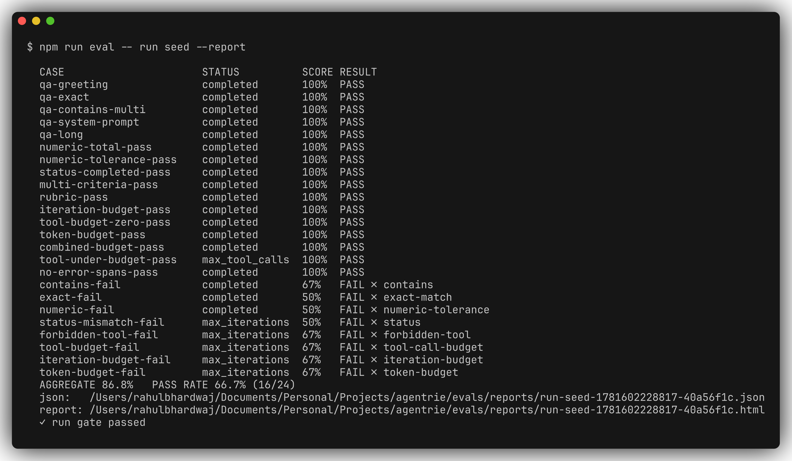
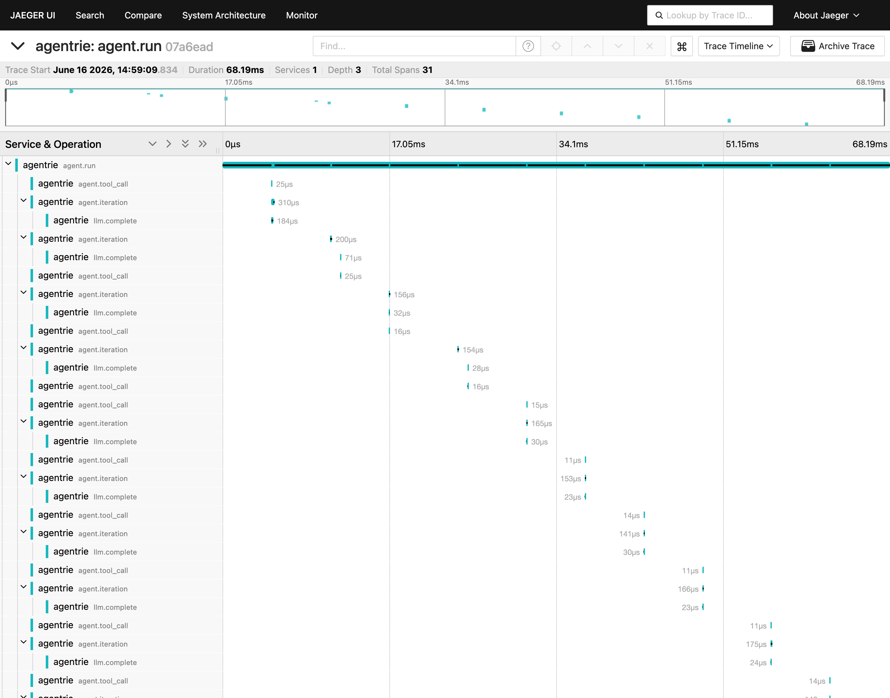

# agentrie

[](https://github.com/rahulbhardwaj94/agentrie/actions/workflows/ci.yml)

A distributed, multi-agent **orchestration & observability platform** built on
NestJS 11, AWS SQS/SNS (via LocalStack locally), Redis, MongoDB, and
OpenTelemetry.

This pass delivers **Phase 0 (the agent decision loop)** and **Phase 1 (state
management)** fully implemented and runnable, with **Phases 2–4** as compiling
scaffolds with complete interfaces and DI wiring, plus a **Phase 5 eval & scoring
layer** that closes the loop. See
[IMPLEMENTATION_STATUS.md](./IMPLEMENTATION_STATUS.md) for the precise real-vs-stubbed
breakdown and what to build next.

> **Traced + measured: see what the agent did, and prove whether it's good.**
> The observability layer shows you *what happened* on every run; the eval layer
> turns those same spans into *scores* — running the agent against datasets,
> grading the structured result **and the trace** (tool-call budgets, forbidden
> tools, iteration/token budgets read straight off `gen_ai.*` spans), and diffing
> two configs so you can answer **"did my change help?"** as a single artifact.
> The HTML report renders each case's span tree inline, so a failing score links
> straight to the trace that explains it
> ([sample run report](./evals/sample-run-report.html),
> [sample compare report](./evals/sample-compare-report.html)).

---

## See it run

Real captured output from a live local run — full walkthrough with every step in
[**DEMO.md**](./DEMO.md). Two highlights:

**The eval layer scores the unmodified agent** (8 of 24 cases fail by design):



**Every run is a trace** — `agent.run` over nested `agent.iteration` →
`llm.complete` / `agent.tool_call` spans, in the Jaeger UI:



---

## What it does

```
            POST /agent/run
                  │
                  ▼
        ┌───────────────────┐   assemble context    ┌──────────────────────┐
        │   AgentRunner      │ ────────────────────▶ │  MemoryStore (Redis) │
        │  (Phase 0 loop)    │ ◀──────────────────── │  token-aware window  │
        └─────────┬─────────┘    tool results        └──────────┬───────────┘
                  │ LlmProvider.complete()                       │ every msg
                  ▼                                              ▼ (source of truth)
        ┌───────────────────┐                          ┌──────────────────────┐
        │  LlmProvider       │                          │  MongoDB (audit)     │
        │ fake | anthropic   │                          └──────────────────────┘
        └───────────────────┘            80% of context limit │
                  │ tool calls                                 ▼ event
                  ▼                                  ┌──────────────────────┐
        ┌───────────────────┐                        │ SummarizationWorker  │
        │  ToolRegistry      │                        │ (lock-guarded)       │
        │ allowlist + Zod    │                        └──────────────────────┘
        └───────────────────┘
```

- **Mongo is the source of truth**; Redis is the hot, token-aware sliding window.
- When active-context tokens cross **80% of the model's context limit**, an
  in-process event triggers background summarization of the oldest evictable half,
  replacing it with a single pinned summary (guarded by a Redis lock).
- Every LLM/tool/iteration emits an **OpenTelemetry span** with GenAI
  semantic-convention attributes; trace context propagates SNS→SQS via W3C
  `traceparent` in message attributes.

---

## Prerequisites

- Node.js 20+ (tested on 22), npm
- Docker + Docker Compose
- AWS CLI (only for `scripts/localstack-init.sh`)

No real AWS account and **no Anthropic API key required** — without a key the
deterministic `FakeLlmProvider` is used automatically.

---

## Quick start

**Two ways to run, by how much you want to spin up:**

| Goal | Command | Needs Docker? |
| --- | --- | --- |
| **Just verify it works** | `npm ci && npm run build && npm test` | ❌ No — the suite stubs Redis/Mongo/SQS |
| **See it run live** | `npm run infra:up && npm run demo` | ✅ Yes — one command brings up the whole stack |

The four backing services (Redis, Mongo, LocalStack, Jaeger) are all bundled in
[`docker-compose.yml`](./docker-compose.yml); the only host prerequisite for the
live demo is Docker. No AWS account and no API key are ever required.

```bash
# 1. Install
npm install

# 2. Bring up infra (Redis, Mongo, LocalStack, Jaeger) and provision queues/topic
docker compose up -d
bash scripts/localstack-init.sh

# 3. Configure
cp .env.example .env        # defaults already target the docker stack

# 4. Build (proves the Phase 2–4 scaffolds compile under strict TS)
npm run build

# 5. Test (idempotency, poison-pill→DLQ, summarization trigger, eviction, agent loop)
npm test

# 6a. Run the HTTP server
npm run start:dev
#   curl -s localhost:3000/agent/run -H 'content-type: application/json' \
#     -d '{"sessionId":"s1","prompt":"echo: use tool: echo {\"message\":\"hi\"}"}'

# 6b. Or run the end-to-end Phase 0+1 demo (crosses the summarization threshold)
LLM_CONTEXT_LIMIT=2000 npm run demo
```

Open the **Jaeger UI** at <http://localhost:16686> and select service `agentrie`
to inspect per-iteration spans with `gen_ai.*` attributes.

### Eval & scoring (the differentiator)

```bash
# Run the seed dataset on the keyless FakeLlmProvider; print the per-case table,
# persist the run to Mongo, and write a self-contained HTML report.
npm run eval -- run seed --report
#   AGGREGATE 86.8%   PASS RATE 66.7% (16/24)   ← 8 cases fail by design

# "Did my change help?" — diff two configs over the same dataset. Regressions are
# surfaced loudly and the process exits non-zero (CI-gateable). --baseline also
# accepts a persisted <runId> instead of a config.
npm run eval -- compare seed \
  --baseline default \
  --candidate '{"maxToolCalls":8,"label":"loose"}' --report
#   ⚠ REGRESSIONS (1): tool-under-budget-pass  [tool-call-budget pass→fail]
```

The runner drives the **unmodified** `AgentRunner`, captures each run's **span
tree** by reusing the existing trace context (one trace id per case), and scores
both the structured result and the trace:

- **outcome scorers** — exact-match, `contains` (declarative predicate), numeric
  tolerance, terminal-status;
- **trace-derived scorers** — `tool-call-budget`, `forbidden-tool`,
  `iteration-budget`, `token-budget` (from the `gen_ai.usage.*` span attributes the
  agent already emits), and `no-error-spans`;
- **LLM-as-judge** — opt-in (`EVAL_JUDGE_ENABLED=true` + a real key); keyless runs
  use a deterministic stub so the suite stays runnable offline, and a judge timeout/
  429/parse-failure degrades to `judge-unavailable` rather than crashing.

A case's `pass` = all of its required scorers pass; the dataset aggregate is the
weighted mean of per-case scores (weights via `EVAL_WEIGHTS`). Every run also drops
a machine-readable `*.json` artifact next to the HTML report for CI.

To use the **real Anthropic model**, set `ANTHROPIC_API_KEY` in `.env` — the
provider factory swaps to `AnthropicProvider` automatically; the loop is identical.

---

## Configuration

All config is validated by **Zod at boot** (`src/config/env.schema.ts`) — the
process exits immediately on any missing/invalid value, and enforces the
cross-field invariant that `SQS_VISIBILITY_TIMEOUT_SEC` exceeds `AGENT_TIMEOUT_MS`.
See [.env.example](./.env.example) for every key and its default.

A few worth knowing:

| Var | Meaning |
| --- | --- |
| `ANTHROPIC_API_KEY` | empty → FakeLlmProvider; set → AnthropicProvider |
| `LLM_CONTEXT_LIMIT` | bounds the Redis window; lower it to see summarization quickly |
| `AGENT_MAX_ITERATIONS` / `AGENT_MAX_TOOL_CALLS` / `AGENT_TIMEOUT_MS` | Phase 0 guardrails |
| `LOCK_TTL_MS` | lock TTL — must exceed worst-case agent execution time |
| `SESSION_ARCHIVE_TTL_DAYS` | TTL for archived sessions (Mongo TTL index) |
| `CONSUMER_ENABLED` | set `true` to start the SQS consumer loop (off by default) |

---

## Deviations from the spec (flagged)

- **CommonJS, not ESM.** The spec pinned ESM; we use the standard NestJS CommonJS
  setup. NestJS 11 + decorators + `reflect-metadata` + `ts-jest` is fragile under
  pure ESM, and "runs end-to-end locally" was the priority. Swapping to ESM later
  is a `tsconfig`/`package.json` change plus extension-ful imports.
- **FakeLlmProvider as the keyless default** (chosen with the user) so the whole
  system runs offline with no API key. The real `AnthropicProvider` is fully
  implemented and activates when a key is present. Both sit behind `LlmProvider`.
- **AnthropicProvider does not enable thinking** — documented in the provider; our
  audit store holds plain content, and Opus requires thinking blocks echoed back
  verbatim across turns.

---

## Project layout

```
src/
  config/         Zod env validation + typed AppConfigService (fail-fast)
  llm/            LlmProvider interface, Fake + Anthropic impls, factory module
  redis/          shared ioredis client
  lock/           Redis SET-NX-PX lock (summarizer + SQS idempotency)
  observability/  OTel SDK boot, TracingService, W3C SNS↔SQS propagation
  tools/          Zod tool registry (allowlist), echo + workspace-jailed read_file
  memory/         Phase 1: Redis window store, Mongo schema/repo, summarizer
  agent/          Phase 0: AgentRunner loop + HTTP controller
  events/         Phase 2 scaffold: SNS publisher, SQS consumer, DLQ helpers
  workers/        sample specialized worker (Code Reviewer)
  eval/           Phase 5: dataset loader, runner, scorers, compare, report, CLI
evals/
  datasets/       versioned, Zod-validated eval datasets (seed.json shipped)
  reports/        generated HTML/JSON artifacts (gitignored)
test/             required + supporting Jest specs (run without docker)
```
